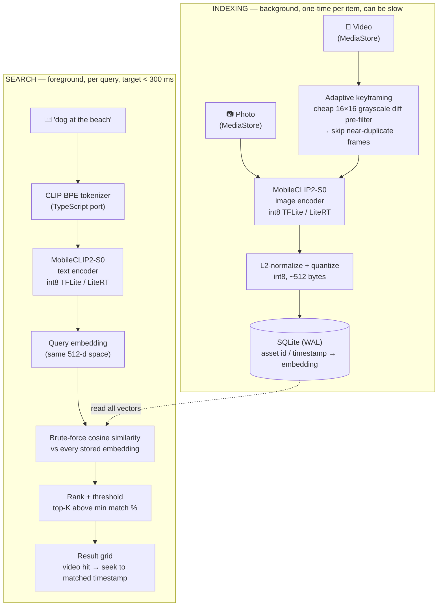

# Sift

**On-device semantic search for your photos and videos.** Type what you're
looking for, "dog at the beach", "handwritten notes", "sunset", and Sift
finds it, including the **exact moment inside a video**. Fully offline: no
cloud, no account, no API cost. Runs on budget/old Android hardware, not just
flagships.

---

## Demo

<video src="https://github.com/CulturalProfessor/sift/raw/main/sift_demo.mp4" controls width="360"></video>

Recorded on the release build, running on the Galaxy F22. 

## What it does

- **Semantic photo search**: searches by *meaning*, not filenames or tags.
  Uses a CLIP-style dual encoder so "food" finds your meals even with no
  metadata.
- **Video moment search (the differentiator)**: indexes representative
  keyframes of each video and, on a hit, opens the video **seeked to that
  timestamp**. Almost no offline app does this.
- **100% on-device**: your photos and videos never leave your phone. There is
  no server anywhere in the app.
- **Incremental indexing**: the first index is a one-time background pass;
  after that only new/changed items are embedded.
- **Runs on low-end hardware**: developed and tested on a Samsung Galaxy F22
  (MediaTek Helio G80, no NPU, 4 GB RAM).

## Architecture

Sift is a dual-encoder CLIP setup (one model, two towers: an image encoder
and a text encoder that are trained to land related images/text in the same
vector space) split into two pipelines with very different latency budgets.
Everything below runs natively on-device — no server, no API call.



**Why brute-force, not ANN/HNSW**: at personal-library scale (thousands,
even tens of thousands of items) a linear scan over int8 vectors is a few
tens of ms — an ANN index would add build time and memory for zero benefit at
this scale. Deliberate call, not a shortcut.

**Why one embedding space for photos and video**: video keyframes are
embedded with the exact same image encoder as photos, so a single query
ranks both in one pass — a video hit just carries an extra timestamp field
that triggers a seek instead of a static thumbnail open.

**Indexing detail — adaptive keyframing**: naive fixed-interval sampling
(e.g. one frame/sec) wastes encoder calls on static footage. Instead Sift
walks candidate frames, does a cheap 16×16 grayscale diff against the *last
stored* keyframe to skip visually near-identical frames, and only pays for
the expensive CLIP encoder call when the diff suggests a real scene change —
then confirms with the embedding itself before storing.

### Engineering highlights

- **Self-converted, self-quantized models.** MobileCLIP2-S0 (PyTorch) →
  float32 TFLite via `litert-torch` (perfect fidelity), then **int8** via
  `ai-edge-quantizer`. Finding: full activation quantization destroys CLIP/ViT
  accuracy (cosine ~0.1 to 0.3); **weight-only int8** preserves it (cosine ~0.99)
  at 3.6× smaller. Image encoder: 13 MB. Text encoder: 65 MB.
- **Preprocessing fidelity.** Matched the Python reference on-device to cosine
  0.978, the key was replicating torchvision's antialiased downsampling with a
  two-pass `inSampleSize` bitmap decode.
- **Native performance.** Decode + preprocess + inference all run in Kotlin
  (LiteRT, multi-threaded XNNPACK). Indexing runs at background thread priority
  with a device-tuned thermal throttle; SQLite is in WAL mode so search stays
  responsive during a long index.
- **CLIP BPE tokenizer in TypeScript**: a faithful port of open_clip's
  `SimpleTokenizer`, verified byte-for-byte against Python.

## Tech stack

React Native (Android-first) · Kotlin native module · LiteRT / TensorFlow Lite
· MobileCLIP2-S0 (int8) · SQLite · ExoPlayer (media3) · TypeScript.

## Build & run

```bash
# 1. Generate the bundled model assets (not committed, see "Models" below)
cd tools/model-conversion
uv venv --python 3.12 .venv
VIRTUAL_ENV=.venv uv pip install -r requirements.txt
# put ~20 images in calib_images/ (any photos), then:
./build_assets.sh

# 2. Install JS deps and run on a connected Android device
cd ../..
npm install
npm start            # Metro, in one terminal
npm run android      # build + install, in another
```

Requires the Android SDK + NDK. Minimum device spec: ARM64, Android 10+.

### Release APK

```bash
cd android && ./gradlew assembleRelease
# -> android/app/build/outputs/apk/release/app-release.apk (~150 MB, all ABIs)
```

## Models

The `.tflite` encoders and BPE merges are **not committed**: the MobileCLIP
weights are under Apple's research-only license (redistribution restricted),
and the files are large. `tools/model-conversion/build_assets.sh` reproduces
them byte-for-byte from open_clip. To publish/distribute, swap to OpenAI CLIP
ViT-B/32 (MIT-licensed); the conversion pipeline is model-agnostic.

## Privacy

Everything runs on the device. There is no network code, no analytics, no
account. The search index lives in the app's private storage and is built by
scanning the device's own gallery. Sharing the APK indexes the recipient's
photos fresh; it carries no one else's data.
